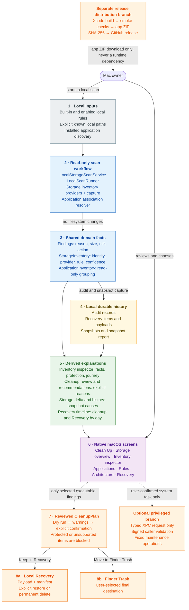

# Second Wind — architecture map

One diagram, one primary flow. Detailed responsibilities are inside the nodes,
so Mermaid does not need to draw crossing links for every individual type.

## Reading rules

- The vertical spine is the only data flow: local inputs become shared facts,
  shared facts are recorded locally, and the screens render derived views.
- The green node contains no new persistence or policy. It only turns existing
  facts into review, delta, history and timeline explanations.
- The orange cleanup branch is the only route that changes storage. It requires
  a reviewed plan and ends in local Recovery or Finder Trash.
- The helper and release pipeline are isolated side branches. Normal scanning,
  explanation, recovery and restore never require either one.
