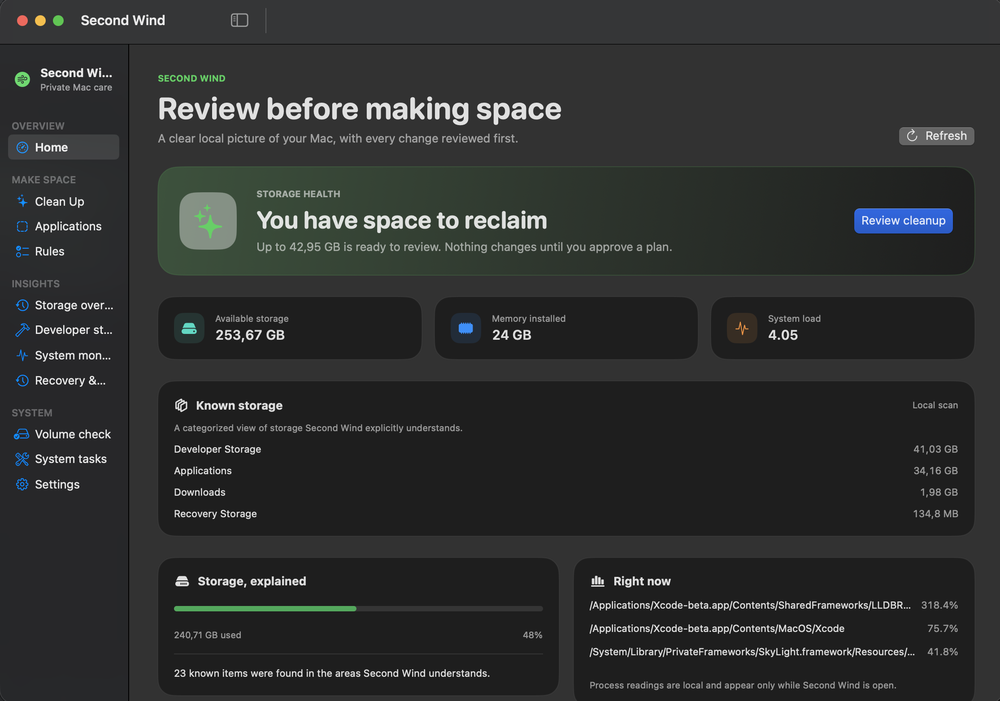
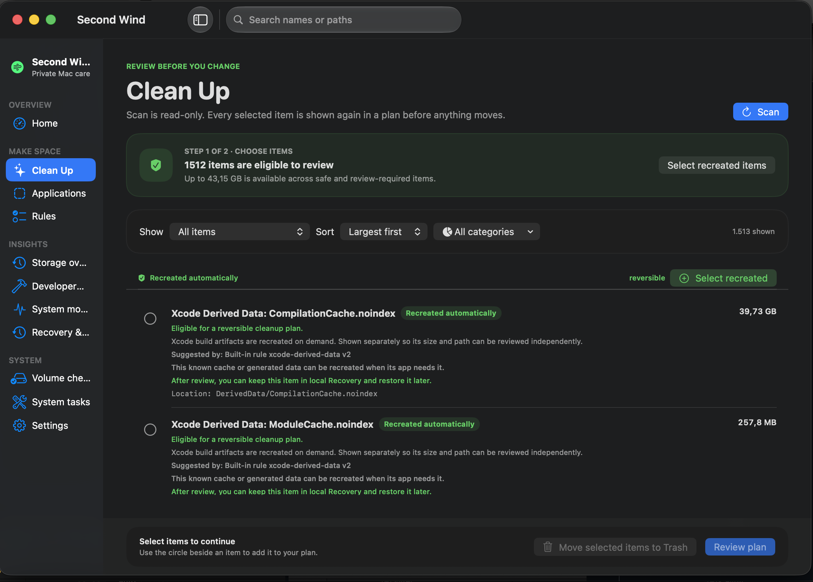
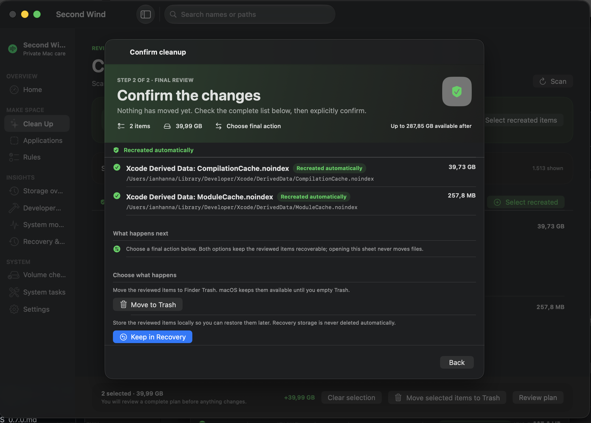
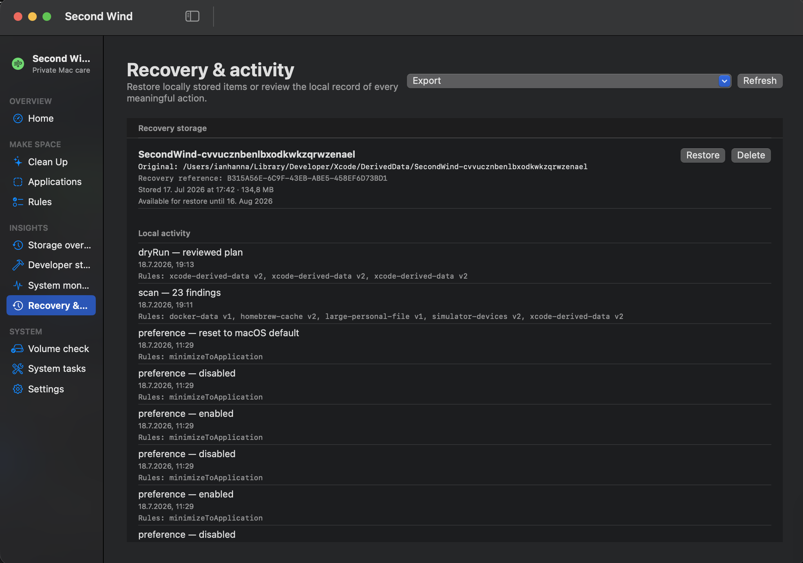
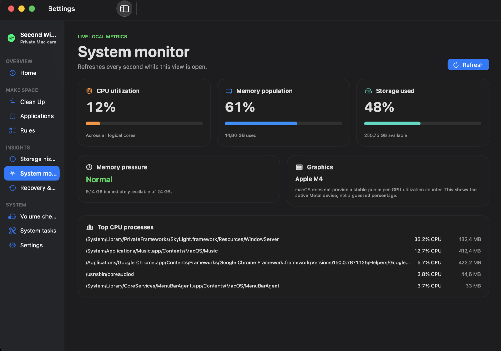
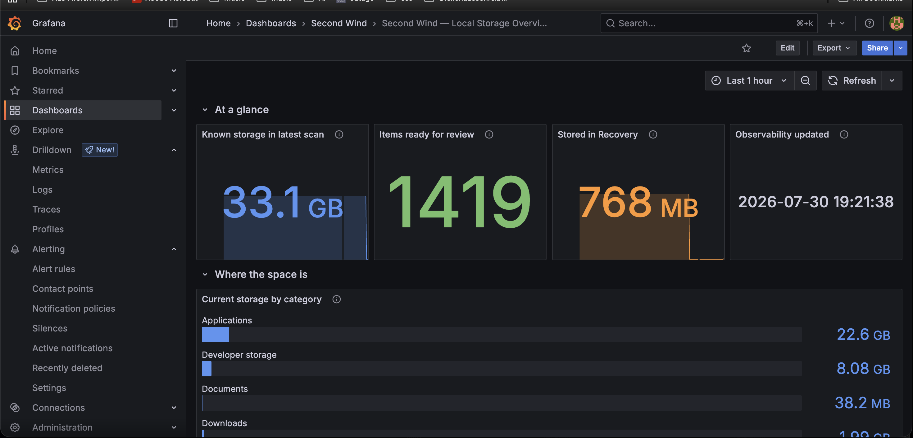
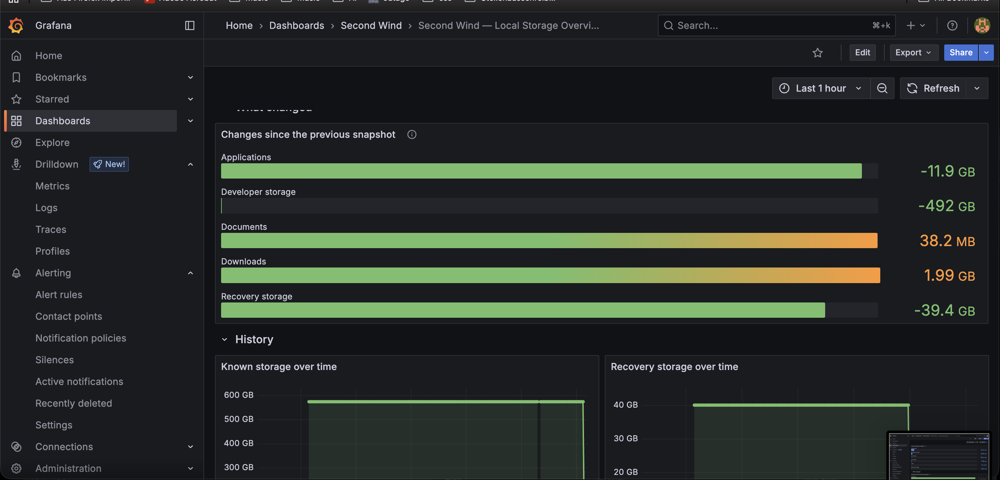
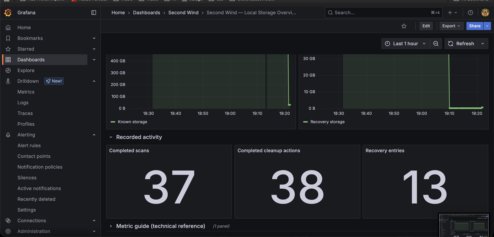
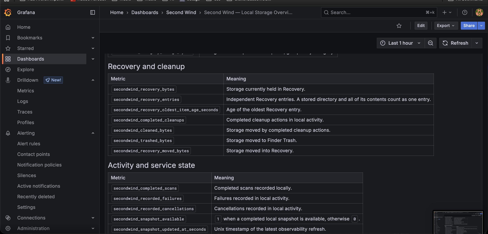

# Second Wind

> Give your Mac room to breathe.

Second Wind is an offline-first macOS 15+ app for reviewing known cleanup
candidates and making deliberate storage changes. It is independently
implemented and has no remote telemetry, analytics, cloud sync, remote rule downloads,
or update checks.

> **1.0.0 Stable Foundation** — The reviewed cleanup workflow, Recovery model,
> local history, persistence schemas, Prometheus metrics, and JSON API v1 now
> have an explicit compatibility contract. Downloads are currently ad-hoc
> signed and not notarized, so macOS may require **Open Anyway** on first launch.

Second Wind is intentionally conservative. It only acts on locations it
explicitly understands. Unknown or ambiguous data is left untouched rather
than guessed at.

> **Latest update · 2 August 2026** Second Wind 1.0 establishes versioned local
> formats, migration safeguards, stable observability responses, documented
> installation, and a reproducible release archive without adding another
> storage or cleanup subsystem.
> Read the [update history](UPDATES.md).

Read the project's [philosophy](PHILOSOPHY.md) for the principles behind those
choices.

## In the app

<p>
  
  
</p>

<p>
  
  
</p>

<p>
  
</p>

### Local observability

<p>
  
  
</p>

<p>
  
  
</p>

## License

Copyright © 2026 Ian Hanna. Second Wind is licensed under
[GPL-3.0-only](LICENSE).

## Quick start

Download `Second-Wind-1.0.0.zip` from GitHub Releases, verify it against
`SHA256SUMS`, move **Second Wind.app** to `/Applications`, and follow the
[installation guide](Docs/INSTALLATION.md). Second Wind requires macOS 15 or
later.

To build the current source instead:

```bash
git clone https://github.com/IanHanna12/secondWind.git
cd secondWind
./Scripts/run-debug-app.sh
```

This launches the standard app without the optional privileged helper enabled.

The [v1 stability contract](Docs/STABILITY.md) documents persistence, API,
migration, upgrading, uninstalling, limitations, and best-effort support.

## What it helps with

- Review storage that Second Wind knows how to handle.
- Move reviewed items to Finder Trash or keep them in local Recovery storage.
- Track changes in the storage areas it understands.
- Explain known Applications, Downloads, Documents, Desktop, developer storage,
  caches, logs, and Recovery storage without presenting them as automatic
  cleanup targets.
- Inspect installed apps, their exact known support paths, and possible
  identifier-based orphaned data. Only exact third-party cache and log paths
  can enter the reviewed cleanup plan; Apple-owned identifiers and data-bearing
  locations remain protected.
- Check a validated local volume with macOS's read-only verification.

## Storage intelligence

Each completed scan records a local inventory of the locations Second Wind
explicitly understands. The Storage history view groups that inventory into
categories, shows the concrete paths behind a category, and compares it with
the previous scan. It can therefore describe observed growth, shrinkage, and
items that are no longer observed without guessing what macOS's protected or
unknown storage contains.

Recommendations are deterministic explanations of known, eligible items. They
never select, move, or delete anything on their own.

## Application storage

Applications is a read-only projection of that same inventory: it separates an
application bundle from its known related storage, such as support data, caches,
logs, preferences, containers, and developer data. Each relationship includes
its path and association reason. Exact bundle-identifier paths can be shown as
possible orphaned data when the corresponding application is not installed.
Only third-party cache and log paths may enter the normal reviewed cleanup
plan; Apple-owned identifiers, Application Support, Containers, Preferences,
saved state, name matches, ambiguous paths, shared resources, and unknown
locations remain protected. Application-specific selection only adds existing,
eligible findings to the normal review, confirmation, Trash, or Recovery flow.

## Guarantees and limits

Second Wind is designed to reduce risk, not eliminate it. Keep current backups
before using any software that can move files.

- Everything stays on your Mac. No account or network service is required.
- All changes are reviewed and explicitly confirmed before execution. Nothing
  is deleted automatically.
- Recovery items remain locally recoverable until you decide otherwise.
- Ambiguous or sensitive locations stay protected rather than being guessed at.
- Storage recommendations are deterministic local rules; they explain a known
  location, size, and—when available—its local modification date.
- It does not promise to speed up your Mac, clean RAM, or invent
  system-health scores.

## Optional privileged helper

The standard app does not need a privileged helper. The Xcode **App** scheme
can build one for rebuilding this Mac's startup-volume Spotlight index, running
fixed periodic scripts on macOS versions that still provide them, and moving a
verified administrator-owned app from `/Applications` into the current user's
Trash. It remains inactive until the user enables it in System tasks and
approves it in System Settings. It accepts neither command text nor arbitrary
paths.

To test it locally, open `Xcode/SecondWind.xcworkspace`, select the same
signing team for both targets, build the **App** scheme, then enable the helper
from System tasks. See the [helper notes](Sources/PrivilegedHelperService/README.md)
for its boundary and local test path.

## Optional local observability

The [observability](observability/README.md) directory contains a completely
standalone local companion for Prometheus and Grafana. It reads only existing
local snapshots, Recovery manifests, and activity records, then serves an
immutable aggregate view on `127.0.0.1`.

The included dashboard separates scan-snapshot storage from live Recovery
storage and reports allocated disk usage, so sparse files are not represented
by their potentially much larger logical capacity.

It is disabled unless started deliberately, exposes no mutation endpoints, and
never exports paths, file names, user names, Recovery references, arbitrary
rule names, or application identities. The Second Wind app does not depend on
it and behaves identically when it is absent or stopped.

## Development

```bash
swift build --disable-sandbox --scratch-path .build/secondwind-debug
swift test --disable-sandbox --scratch-path .build/secondwind-debug
```

For the GUI app, use:

```bash
./Scripts/run-debug-app.sh
```

## Xcode app build and packaging

The [Xcode](Xcode/README.md) directory contains the checked-in Xcode project,
the App scheme, and the optional helper target. It also documents the path for
local signing and later direct distribution.
